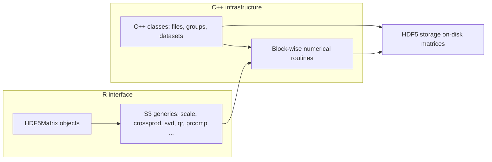

# BigDataStatMeth <!--  -->

<!-- badges: start -->
[](https://CRAN.R-project.org/package=BigDataStatMeth)
[](https://CRAN.R-project.org/package=BigDataStatMeth)
[](https://isglobal-brge.github.io/BigDataStatMeth/)
[](https://opensource.org/licenses/MIT)
<!-- badges: end -->

## Overview

**BigDataStatMeth** provides scalable statistical computing for matrices stored
in HDF5 files. The package is designed as a two-level tool: it provides a
standard R interface for users working with HDF5-backed matrices, and a reusable
C++ infrastructure for developers implementing new block-wise statistical methods.

The R interface is based on `HDF5Matrix` objects and S3 methods, so users can
work with familiar R calls such as `dim()`, `[`, `%*%`, `crossprod()`, `scale()`,
`cor()`, `svd()`, `prcomp()`, `qr()`, `chol()`, and `solve()`. The C++
infrastructure provides classes and routines for managing HDF5 files, groups, and
datasets, together with block-wise numerical methods that can be reused from
Rcpp-based code.



Most users will interact with the R/S3 interface. Developers can build on the C++
headers to extend the package with new HDF5-backed methods while retaining
efficient execution through compiled code.

### Key Features

- **HDF5-backed matrices** through a familiar `HDF5Matrix`/S3 interface
- **Block-wise algorithms** — process matrices larger than available RAM through
  intelligent partitioning
- **Parallel processing** — multi-threaded operations for enhanced performance
- **Comprehensive decompositions** — SVD, PCA, QR, Cholesky, eigendecomposition,
  and pseudoinverse
- **Statistical transformations** — centering, scaling, correlation, sweep, and
  aggregations by row/column
- **C++ developer infrastructure** — reusable classes and routines for building
  new scalable methods without reimplementing HDF5 management or block iteration
- **HDF5 compression and file-space reuse** — controlled disk usage across
  iterative workflows

## Installation

### From CRAN (Stable Release)

```r
install.packages("BigDataStatMeth")
```

### From GitHub (Development Version)

```r
# Install devtools if needed
install.packages("devtools")

devtools::install_github("isglobal-brge/BigDataStatMeth")
```

### System Requirements

**R packages:**

- `Matrix`
- `RcppEigen`
- `RSpectra`

**System dependencies:**

- HDF5 library (>= 1.8)
- C++17 compatible compiler
- For Windows: [Rtools](https://cran.r-project.org/bin/windows/Rtools/)

## Quick Start

```r
library(BigDataStatMeth)

h5file <- tempfile(fileext = ".h5")

set.seed(1)
X <- matrix(rnorm(500 * 100), nrow = 500, ncol = 100)

# Write an in-memory matrix to HDF5
X_h5 <- hdf5_create_matrix(
  filename = h5file,
  dataset  = "data/X",
  data     = X,
  overwrite = TRUE
)

dim(X_h5)
colMeans(X_h5)

# Standard R operations on the HDF5-backed matrix
XtX_h5  <- crossprod(X_h5)
X_sc_h5 <- scale(X_h5)

# Decompositions
svd_res <- svd(X_h5, nu = 5, nv = 5, center = TRUE, scale = TRUE)
pca_res <- prcomp(X_h5, center = TRUE, scale. = TRUE, ncomponents = 5)

close(X_h5)
hdf5_close_all()
```

## Core Functionality

### Standard R interface (`HDF5Matrix`/S3)

| Category | Representative calls |
|:---|:---|
| Core object handling | `hdf5_create_matrix()`, `hdf5_matrix()`, `dim()`, `nrow()`, `ncol()`, `is_open()`, `close()` |
| HDF5 inspection and I/O | `list_datasets()`, `hdf5_import()`, `hdf5_import_multiple()`, `as.matrix()`, `as.data.frame()` |
| Subsetting and assignment | `X[i, j]`, `X[i, j] <- value` |
| Dimension names | `rownames()`, `colnames()`, `dimnames()` |
| Element-wise arithmetic | `X + Y`, `X - Y`, `X * Y`, `X / Y` |
| Matrix algebra | `%*%`, `crossprod()`, `tcrossprod()`, `cbind()`, `rbind()` |
| Aggregations | `colSums()`, `rowSums()`, `colMeans()`, `rowMeans()`, `colVars()`, `rowVars()`, `colSds()`, `rowSds()`, `colMins()`, `rowMins()`, `colMaxs()`, `rowMaxs()` |
| Scalar summaries | `mean()`, `var()`, `sd()` |
| Normalization and transformations | `scale()`, `sweep()` |
| Correlation | `cor()` |
| Decompositions | `svd()`, `prcomp()`, `eigen()`, `pseudoinverse()` |
| Factorizations and solvers | `qr()`, `chol()`, `solve()` |
| Diagonal operations | `diag()`, `diag<-()`, `diag_op()`, `diag_scale()` |
| Split, reduce, and apply | `split_dataset()`, `split()`, `reduce()`, `apply_function()` |
| Resource management and options | `hdf5matrix_options()`, `show_hdf5matrix_options()`, `hdf5_close_all()` |

### Specialized helpers (`bd*`)

Some utilities do not map directly to an existing base R generic and retain the
`bd*` prefix. Examples include `bdCreate_hdf5_group()`,
`bdmove_hdf5_dataset()`, and `bdWrite_hdf5_dimnames()`. These functions are
part of the package API and are documented in their corresponding help pages.

## Global Options

Common settings for HDF5-backed computations can be configured with
`hdf5matrix_options()`. These include parallel execution, number of threads,
block size, and HDF5 compression level.

```r
hdf5matrix_options(
  paral       = TRUE,
  threads     = 4L,
  block_size  = 512L,
  compression = 6L
)
```

These settings are especially useful for operations dispatched through standard R
generics, where the usual R call does not always expose all low-level execution
parameters. Operation-specific parameters can also be passed directly when a
method supports them (see `?svd.HDF5Matrix`, `?prcomp.HDF5Matrix`,
`?qr.HDF5Matrix`).

## C++ Infrastructure for New Methods

The C++ API is a central part of `BigDataStatMeth`. The package exposes C++
classes for HDF5 files, groups, and datasets, and implements block-wise routines
for matrix algebra, decompositions, and statistical operations. These are the same
building blocks used internally by the R/S3 interface.

This design allows developers to focus on the statistical or numerical method
itself, rather than reimplementing HDF5 file handling, block iteration, or data
movement.

```cpp
#include <Rcpp.h>
#include "BigDataStatMeth.hpp"

using namespace BigDataStatMeth;

// [[Rcpp::export]]
void custom_analysis(std::string filename, std::string group, std::string dataset) {

    std::unique_ptr<BigDataStatMeth::hdf5Dataset> ds(nullptr);

    ds.reset( new BigDataStatMeth::hdf5Dataset(filename, group, dataset, false ) );
    ds->openDataset();

    // Block-wise processing using BigDataStatMeth routines
    // ...

    // ds is automatically closed and released when it goes out of scope
}
```

See [Developing Methods](https://isglobal-brge.github.io/BigDataStatMeth/developing-methods/)
for complete examples in both R and C++.

## Documentation

Comprehensive documentation is available at
**[https://isglobal-brge.github.io/BigDataStatMeth/](https://isglobal-brge.github.io/BigDataStatMeth/)**

- **[Getting Started](https://isglobal-brge.github.io/BigDataStatMeth/tutorials/getting-started.html)** — installation and first steps
- **[Fundamentals](https://isglobal-brge.github.io/BigDataStatMeth/fundamentals/)** — HDF5 storage and block-wise computing concepts
- **[Workflows](https://isglobal-brge.github.io/BigDataStatMeth/workflows/)** — complete analysis examples
- **[Developing Methods](https://isglobal-brge.github.io/BigDataStatMeth/developing-methods/)** — building new statistical methods using the R and C++ APIs
- **[API Reference](https://isglobal-brge.github.io/BigDataStatMeth/api-reference/)** — complete function documentation (R and C++)

```r
# List available vignettes
vignette(package = "BigDataStatMeth")

# View the main vignette
vignette("BigDataStatMeth")
```

## Performance

BigDataStatMeth is designed for efficiency at scale:

- **Block-wise computation** — process very large matrices with a controlled,
  fixed memory footprint
- **Parallel algorithms** — multi-core support for matrix operations and
  decompositions
- **Optimized I/O** — efficient HDF5 chunking and access patterns
- **File-space reuse** — space released by removed or overwritten intermediate
  datasets is tracked and reused within the same file

## Use Cases

BigDataStatMeth is suited for any analytical workflow that involves large matrix
operations. Typical scenarios include:

- **Large-scale matrix computations** — multiplication, crossproducts, and
  element-wise operations on matrices that exceed available RAM
- **Dimensionality reduction** — PCA and SVD on wide or tall matrices stored on
  disk
- **Statistical inference** — regression, Cholesky-based solvers, and correlation
  analysis at scale
- **Multi-dataset integration** — combining and analyzing matrices across
  multiple data sources, with support for multi-omics workflows
- **Method development** — building and prototyping new scalable statistical
  methods using the C++ infrastructure without reimplementing HDF5 management or
  block iteration

## HDF5 Resource Management

HDF5-backed objects keep file handles open while they are in use. Objects can be
closed individually with `close()`, and all open HDF5 handles managed by the
package can be closed with `hdf5_close_all()`.

```r
close(X_h5)
hdf5_close_all()
```

After calling `hdf5_close_all()`, HDF5-backed objects that were open should be
reopened before being used again. Calling `gc()` may also help trigger R
finalizers for objects that are no longer referenced.

## Citation

If you use BigDataStatMeth in your research, please cite:

```
Pelegri-Siso D, Gonzalez JR (2026). BigDataStatMeth: Statistical Methods
for Big Data Using Block-wise Algorithms and HDF5 Storage.
R package version 2.0.0, https://github.com/isglobal-brge/BigDataStatMeth
```

BibTeX entry:

```bibtex
@Manual{bigdatastatmeth,
  title  = {BigDataStatMeth: Statistical Methods for Big Data},
  author = {Dolors Pelegri-Siso and Juan R. Gonzalez},
  year   = {2026},
  note   = {R package version 2.0.0},
  url    = {https://github.com/isglobal-brge/BigDataStatMeth},
}
```

## Contributing

Contributions are welcome. Please:

1. Fork the repository
2. Create a feature branch (`git checkout -b feature/new-feature`)
3. Commit your changes (`git commit -m 'Add new feature'`)
4. Push to the branch (`git push origin feature/new-feature`)
5. Open a Pull Request

### Development Guidelines

- Follow existing code style (Rcpp coding standards for C++, tidyverse style for R)
- Add tests for new functionality
- Update documentation — Roxygen2 for R functions, Doxygen for C++ headers
- Run `R CMD check` before submitting

## Getting Help

- **Documentation**: [https://isglobal-brge.github.io/BigDataStatMeth/](https://isglobal-brge.github.io/BigDataStatMeth/)
- **Issues**: [GitHub Issues](https://github.com/isglobal-brge/BigDataStatMeth/issues)

## License

MIT License — see [LICENSE](LICENSE) file for details.

## Authors

**Dolors Pelegri-Siso**
Bioinformatics Research Group in Epidemiology (BRGE)
ISGlobal — Barcelona Institute for Global Health

**Juan R. Gonzalez**
Bioinformatics Research Group in Epidemiology (BRGE)
ISGlobal — Barcelona Institute for Global Health

## Acknowledgments

Development of BigDataStatMeth was supported by ISGlobal and the Bioinformatics
Research Group in Epidemiology (BRGE).
