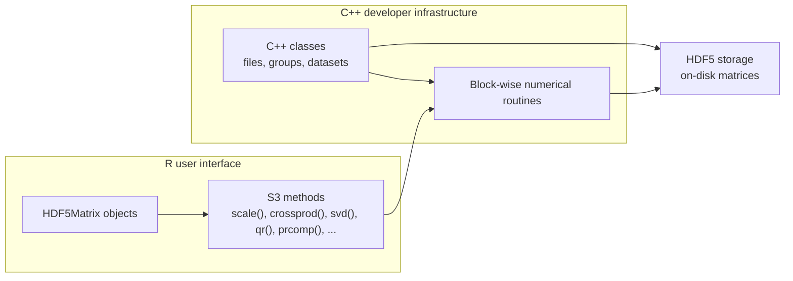

# BigDataStatMeth

`BigDataStatMeth` provides scalable statistical computing for matrices
stored in HDF5 files. The package is designed as a two-level tool: it
provides a standard R interface for users working with HDF5-backed
matrices, and a reusable C++ infrastructure for developers implementing
new block-wise statistical methods.

The R interface is based on `HDF5Matrix` objects and S3 methods, so users
can work with familiar R calls such as `dim()`, `[`, `%*%`, `crossprod()`,
`scale()`, `cor()`, `svd()`, `prcomp()`, `qr()`, `chol()`, and `solve()`.
The C++ infrastructure provides classes and routines for managing HDF5
files, groups, and datasets, together with block-wise numerical methods
that can be reused from Rcpp-based code.

## Why BigDataStatMeth?

Large matrix workflows often require a compromise between usability and
performance. Standard R code is convenient but usually assumes that data
fit in memory. Low-level C++ or HDF5 code can be efficient but requires
substantial implementation effort.

`BigDataStatMeth` aims to bridge these two levels. Users can analyze
HDF5-backed matrices from R using a familiar interface, while developers
can reuse the same C++ infrastructure to implement new scalable methods
without rewriting HDF5 file management, block iteration, compression
handling, or numerical kernels from scratch.

## Package architecture



Most users will interact with the R/S3 interface. Developers can build on
the C++ headers to extend the package with new HDF5-backed methods while
retaining efficient execution through compiled code.

## Main features

- HDF5-backed matrices through the `HDF5Matrix` interface.
- Standard R-style operations on matrices stored on disk.
- Block-wise and parallel computation.
- HDF5 compression and file-space reuse.
- C++ classes for managing HDF5 files, groups, and datasets.
- Reusable C++ block-wise routines for extending the package with new
  scalable methods.

## Representative functionality

| Category | Representative calls |
|:---|:---|
| Core object handling | `hdf5_create_matrix()`, `hdf5_matrix()`, `dim()`, `nrow()`, `ncol()`, `close()` |
| I/O and inspection | `list_datasets()`, `hdf5_import()`, `hdf5_import_multiple()`, `as.matrix()`, `as.data.frame()` |
| Subsetting and assignment | `X[i, j]`, `X[i, j] <- value` |
| Dimension names | `rownames()`, `colnames()`, `dimnames()` |
| Element-wise arithmetic | `X + Y`, `X - Y`, `X * Y`, `X / Y` |
| Matrix algebra | `%*%`, `crossprod()`, `tcrossprod()`, `cbind()`, `rbind()` |
| Aggregations | `colSums()`, `rowSums()`, `colMeans()`, `rowMeans()`, `colVars()`, `rowVars()` |
| Statistical transformations | `scale()`, `sweep()`, `cor()` |
| Decompositions and factorizations | `svd()`, `prcomp()`, `qr()`, `chol()`, `solve()`, `eigen()`, `pseudoinverse()` |
| Additional high-level utilities | selected `bd*` functions for specialized workflows without a direct standard R generic |
| Developer infrastructure | C++ classes and headers for HDF5-backed block-wise methods |

## Installation

From CRAN:

```r
install.packages("BigDataStatMeth")
```

## Minimal example

```r
library(BigDataStatMeth)

h5file <- tempfile(fileext = ".h5")

set.seed(1)
X <- matrix(rnorm(100 * 20), nrow = 100, ncol = 20)

X_h5 <- hdf5_create_matrix(
  filename = h5file,
  dataset = "data/X",
  data = X,
  overwrite = TRUE
)

X_h5
dim(X_h5)
colMeans(X_h5)

XtX_h5 <- crossprod(X_h5)
dim(XtX_h5)

X_scaled <- scale(X_h5)
svd_res <- svd(X_h5, nu = 3, nv = 3)

close(X_h5)
hdf5_close_all()
```

## Global options

Common settings for HDF5-backed computations can be configured with
`hdf5matrix_options()`. These options include parallel execution, number
of threads, block size, and HDF5 compression level.

```r
hdf5matrix_options(
  paral = TRUE,
  threads = 2L,
  block_size = 512L,
  compression = 6L
)
```

These settings are especially useful for operations dispatched through
standard R generics, where the usual R call does not always expose all
low-level execution parameters.

## C++ infrastructure for new methods

The C++ API is a central part of `BigDataStatMeth`. The package provides
C++ classes for HDF5 files, groups, and datasets, and implements
block-wise routines for matrix algebra, decompositions, transformations,
and statistical operations. These are the computational building blocks
used by the R/S3 interface.

This design makes it possible to develop new methods in C++ and expose
them to R through Rcpp while reusing the existing HDF5-backed
infrastructure. Developers can therefore focus on the statistical or
numerical method itself, rather than reimplementing low-level HDF5 file
handling, block iteration, compression management, and data movement.

## HDF5 resource management

HDF5-backed objects keep file handles open while they are in use. Objects
can be closed individually with `close()`, and all open HDF5 handles
managed by the package can be closed with `hdf5_close_all()`.

```r
close(X_h5)
hdf5_close_all()
```

After calling `hdf5_close_all()`, HDF5-backed objects that were open
should be reopened before being used again.

## Documentation

To get started, see:

```r
help("BigDataStatMeth")
vignette("BigDataStatMeth")
```
