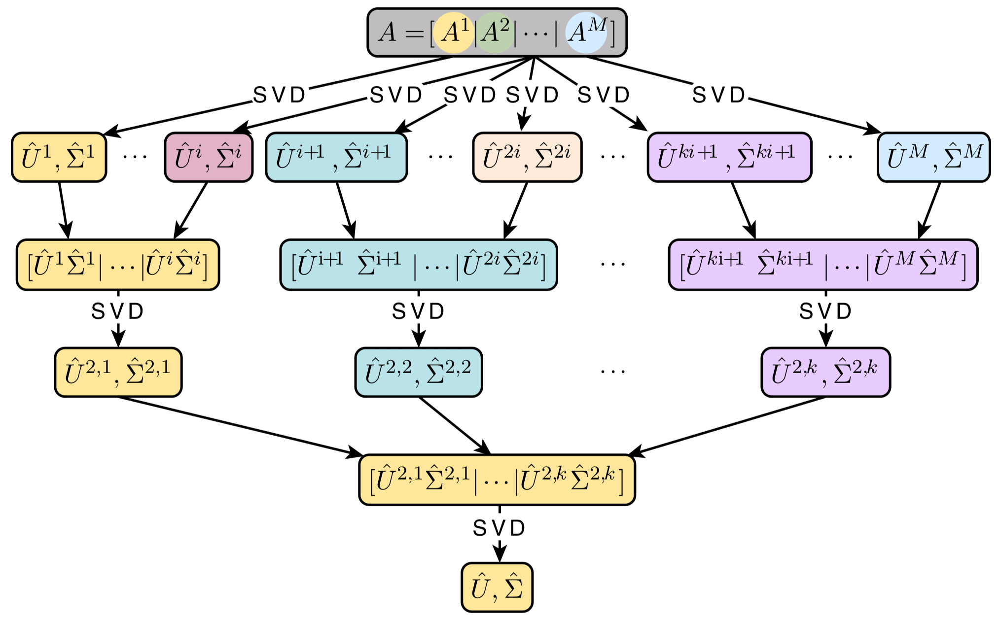

```{r setup, include = FALSE}
library(knitr)
library(BiocStyle)

knitr::opts_chunk$set(collapse = TRUE, comment = "", cache=FALSE, message = FALSE, width = 180)
```

```{r, cleanup, echo=FALSE, include=FALSE}
if( isTRUE(file.exists('delayed.hdf5'))) {
    file.remove('delayed.hdf5')
}
if( isTRUE(file.exists('robjects.hdf5'))){
    file.remove('robjects.hdf5')
}

```

<!--
```{r r_setup, include = FALSE}
options(width = 180)
```
-->
# Prerequisites

The package requires other `Bioconductor` packages to be installed. These include: `beachmat`, `HDF5Array`,
`DelayedArray`, `rhdf5`. Other required R packages are: `Matrix`,
`RcppEigen` and `RSpectra`. 

# Overview

This package implements seveal matrix operations using `DelayMatrix` objects and HDF5 data files as well as some basic algebra operations that can be used to carry out some statistical analyses using standard methodologies such as principal component analyses or least squares estimation. The package also contains specific statatistical method mainly used in `omic` data analysis such as lasso regression. 

# Getting started

First, let us start by loading the required packages to describe the main capabilities of the package

```{r, load}
library(BigDataStatMeth)
library(DelayedArray)
library(rhdf5)
library(DT)
```

These other packages are required to reproduce this vignette

```{r, load2}
library(microbenchmark)
```

# Previous knowledge

## HDF5 data files

Hierarchical Data Format (HDF) is a set of file formats  designed to store and organize large amounts of data. It is supported by The HDF Group, a non-profit corporation whose mission is to ensure continued development of HDF5 technologies and the continued accessibility of data stored in HDF.

HDF5 is a technology suite that makes possible the management of extremely large and complex data collections, can accomodate virtually every kind of data in a single file, sequences, images, SNP matrices, and every other type of data and metadata associated with an experiment.

There is no limit on the number or size of data objects in the collection, giving great flexibility for omic data. Is high-performance I/O with a rich set of integrated performance features that allow for access time and storage space optimizations

HDF5 file structure include only *two major types of object*:

- `Datasets`, which are multidimensional arrays of a homogeneous type, in datasets we can store omics data  associated to genomics, transcriptomics, epigonomics, proteomics, metabolomics experiments

- `Groups`, which are container structures which can hold datasets and other groups

This results in a truly hierarchical, filesystem-like data format

```{r hdf5Img, out.width = '60%', fig.align = 'center', fig.cap = "HDF5 hierarchical structure", echo=FALSE}
knitr::include_graphics("imgs/hdf5_squema.jpg")
```


## Basics in rhdf5

**Create hdf5 file**

The `Create_HDF5_matrix_file` function implemented in this package creates an hdf5 file with a group and a dataset in one step. This function allows to create datasets from `DelayedMAtrix` objects using `beachmat` library as well as standard R matrices.

```{r hdf5Create}
library(rhdf5)
library(DelayedArray)

set.seed(5234)
n <- 100
m <- 10000
A <- matrix(rnorm(n*m,mean=0,sd=1), n,m)

Ad <- DelayedArray(A)

# Create a file with a dataset from DelayedMatrix Ad in INPUT group
Create_HDF5_matrix_file("delayed.hdf5", Ad, "INPUT", "A")

# We also can create a dataset from R matrix object
Create_HDF5_matrix_file("robjects.hdf5", A, "INPUT", "A")
```

**Add datasets in hdf5 file**

The `Create_HDF5_matrix` allows to create a dataset in existing file. We can create the dataset in any group, if group doesn't exists in file, the group is created before append the dataset.

```{r hdf5AddDataset}
set.seed(5234)
n <- 50
m <- 12000
B <- matrix(rnorm(n*m,mean=3,sd=0.5), n,m)

Bd <- DelayedArray(B)

# Create dataframe B with Bd matrix in delayed.hdf5 file at INPUT group
Create_HDF5_matrix(Bd, "delayed.hdf5", "INPUT", "B");

# Create dataframe data with Ad matrix in delayed.hdf5 file at OMIC group
set.seed(5234)
n <- 150000
m <- 50
odata <- matrix(rnorm(n*m,mean=0,sd=1), n,m)

Create_HDF5_matrix(odata, "delayed.hdf5", "OMICS", "data")

```

**Open and get hdf5 content file**

We can open an existing file show contents and access data using functions from `rhdf5` package. `rhdf5` is an R interface for HDF5. The file must always be opened before working with it.

```{r hdf5Open}
# Examine hierarchy before open file
h5ls("delayed.hdf5")

# Open file
h5fdelay = H5Fopen("delayed.hdf5")
# Show hdf5 hierarchy (groups)
h5fdelay

```

**Access datasets data**

The \$ operator can be used to access the next group level, this operator reads the object from disk. We can assign the dataset contents to an R object in order to work with it.

```{r hdf5Dataset}
Adata = h5fdelay$OMICS$data
Adata[1:3,1:6]
```

**Close hdf5 file**

After work with hdf5 we always must close the file. We can close only one file with `H5Fclose` function or close all hdf5 opend files with `h5closeAll` function

```{r hdf5Close}
# Close delayed.hdf5 file
H5Fclose(h5fdelay)

# Open 2 files and close all
h5fdelay = H5Fopen("delayed.hdf5")
h5fr = H5Fopen("robjects.hdf5")

h5closeAll()
```

More information about working with hdf5 files in r [@rhdf5]

# Matrix Multiplication

In this section, different products of matrices and vectors are introduced. The methods implement different strategies including block multiplication algorithms and the use of parallel implementations. 

## Simple matrix multiplication

The function `blockmult()` performs a simple sequential matrix multiplication. The function allows the use of `DelayedMAtrix` objects as well as standard R matrices.


Let us simulate to set of matrices to illustrate the use of the function accross the entire documment. First, we simulate a simple case with to matrices A and B with dimensions 500x500 and 500x750, respectively. Second, another example with dimensions 1000x10000 are use to evaluate the performance in large matrices. The examples with big datasets will be illustrated using real data belonging to different omic settings. We can simulate to matrices with the desired dimensions by

```{r mat_sim}
set.seed(123456)
n <- 500
p <- 750
A <- matrix(rnorm(n*n), nrow=n, ncol=n)
B <- matrix(rnorm(n*p), nrow=n, ncol=p)

n <- 1000
p <- 10000
Abig <- matrix(rnorm(n*n), nrow=n, ncol=n)
Bbig <- matrix(rnorm(n*p), nrow=n, ncol=p)
```

They can be converted into `DelayedMatrix` object by simply

```{r getDelayed}
DA <- DelayedArray(A)
DB <- DelayedArray(B)
```

Matrix multiplication is then done by

```{r mat_mult}
AxB <- blockmult(A, B)
AxBDelay <- blockmult(DA, DB)
AxBDelay [1:5,1:5]
```

This verifies that computations are fine, even when comparing with matrix multiplication with R (i.e. using `%*%)

```{r check}
all.equal(AxB, AxBDelay)
all.equal(A%*%B, AxBDelay)
```

The process can be speed up by making computations in parallel using `paral=TRUE`. 

```{r noblockmultparal}
AxB <- blockmult(A, B, paral = TRUE)
AxBDelay <- blockmult(DA, DB, paral = TRUE) 

all.equal(AxB, AxBDelay)
```

We can show that the parallel version really improves the computational speed and also how the blockmult function improves the R implementation.

```{r benchmark1}
# microbenchmark(
#   R = A%*%B,
#   noparal = blockmult(A, B),
#   paral = blockmult(A, B, paral=TRUE),
#   times = 10)
```

With `paral=TRUE`, an optional parameter threads can be used to indicate the number of `threads` to launch simultaneously, if `threads=NULL` the function takes the available threads - 1, leaving one available for user.

```{r noblockmultparalthreads}
AxB <- blockmult(A, B, paral = TRUE, threads = 2)
AxBDelay <- blockmult(DA, DB, paral = TRUE, threads = 3) 

all.equal(AxB, AxBDelay)
```

We can show how the number of threads affects performance.

```{r benchmark1b}
# microbenchmark(
#   AxBnThread2 = blockmult(DA, DB, paral = TRUE, threads = 2) ,
#   AxBnThread3 = blockmult(DA, DB, paral = TRUE, threads = 3) ,
#   AxBnThread4 = blockmult(DA, DB, paral = TRUE, threads = 4) ,
#   times = 10)
```


## Block matrix multiplication

A block matrix or a partitioned matrix is a matrix that is interpreted as having been broken into sections called blocks or submatrices. Intuitively, a block matrix can be visualized as the original matrix with a collection of horizontal and vertical lines, which break it up, or partition it, into a collection of smaller matrices. the implementation has been made from the adaptation of the Fox algorithm [[1]](#1).

Matrix multiplication using block matrices is implemented in the `blockmult()` function. It only requires to setting the argument `block_size` different from 0, by default `block_size = 128`. 

```{r blockmult }
AxB <- blockmult(A, B, block_size = 10)
AxBDelay <- blockmult(DA, DB, block_size = 10 )
```

As expected the results obtained using this procedure are the correct ones

```{r}
all.equal(AxBDelay,A%*%B)
all.equal(AxB, AxBDelay)
```

Note that when the argument `block_size` is larger than any of the dimensions of matrix A or B the `blocks_size` is set to `min(cols(A), rows(A), cols(B), rows(B))`. 

As in the case of using a simple matrix multiplication, one can make the  operations in parallel with `paral = TRUE` and optionally indicating the number of threads to use in parallel computing .

```{r blockmultparal}
AxB <- blockmult(A, B, block_size = 10, paral = TRUE)
AxBDelay <- blockmult(DA, DB, block_size = 10, paral = TRUE )
AxBDelayT <- blockmult(DA, DB, block_size = 10, paral = TRUE, threads =  3 )

all.equal(AxBDelay,A%*%B)
all.equal(AxB, AxBDelay)
all.equal(AxBDelay, AxBDelayT)
```

To work with big matrices `blockmult()` saves matrices in hdf5 file format in order to be able to operate with them in blocks and not overload the memory, by default are considered large matrices if the number of rows or columns is greater than 5000, but it can be changed with `bigmatrix` argument.


```{r blockmultbm1}
DAbig <- DelayedArray(Abig)
DBbig <- DelayedArray(Abig)

# We want to force it to run in memory
AxBNOBig <- blockmult(DAbig, DBbig, bigmatrix = 100000) 

# We consider a big matrix if number of rows or columns are > 500
AxBBig3000 <- blockmult(DAbig, DBbig, bigmatrix = 500)

```

Depending on whether the calculation has been performed directly in memory or from an hdf5 file, the returned object type is different.

If we work in memory results are returned as a current r matrix object, 

```{r blockmultresmat}
class(AxBNOBig)
AxBNOBig[1:5,1:5]
```

if we work in disk, we return a list with the filnme and the dataset that contains the results inside the  hdf5 file. Then we can open the hdf5 file and get the result matrix and the original matrices, 

To work in R with hdf5 data object we can use the `rhdf5` function library from `bioconductor`, we can open file and read all the content

```{r blockmultresfile}

h5data <- H5Fopen(AxBBig3000$file)

# We can get wher data is stored
AxBBig3000$dataset

# We observe thad the data is in folder OUTPUT dataset C
reshdf5 <- h5data$OUTPUT$C
reshdf5[1:5,1:5]

all.equal(reshdf5, AxBNOBig)
```

Remember that it is **It is important to close all dataset, group, and file handles when not used** anymore,

```{r blockmultresfileclose}
# Close file
H5Fclose(h5data)
```

Here, we compare the performace of the block method with the different options.

```{r benchmark2, cache=TRUE}
# bench1 <- microbenchmark(
#   noblockParal = blockmult(Abig, Bbig, paral = TRUE),
#   blockParalfile = blockmult(Abig, Bbig, block_size = 256, paral=TRUE),
#   blockParalmem = blockmult(Abig, Bbig, block_size = 256, paral=TRUE,
#                             bigmatrix = 100000),
#   times = 3 )
#
# bench1
```

The same information is depicted in the next Figure which illustrates the comparison between the different assessed methods

```{r, bench1, fig.height=3, fig.width=3}
# ggplot2::autoplot(bench1)
```

Plot shows that the execution time in hdf5 files is greater than memory execution time, this is due to the read and write time required to access to disk data. At higher disk speed better performance.

# Cross-product and Transposed Cross-product

To perform a cross-product $C = A^t A$ you can call `bdcrossprod()` function.

```{r crossprod }
n <- 500
m <- 250
A <- matrix(rnorm(n*m), nrow=n, ncol=m)
DA <- DelayedArray(A)

# Cross Product of a standard R matrix
cpA <- bdcrossprod(A)
# Result with DelayedArray data type
cpDA <- bdcrossprod(DA)
```

We obtain the expected values computed using `crossprod` function

```{r check_cp}
all.equal(cpDA, crossprod(A))
```

you may also set `transposed=TRUE` (default value transposed=false) to get a transposed cross-product $C = A A^t$

```{r nocrossprod}
# Transposed Cross Product R matrices
tcpA <- bdcrossprod(A, transposed = TRUE)
# With DelayeArray data types
tcpDA <- bdcrossprod(DA, transposed = TRUE)
```

We obtain the expected values computed using `tcrossprod` function

```{r check_tcp}
all.equal(tcpDA, tcrossprod(A))
```

We can show that the implemented version really improves the  R implementation computational speed.

```{r benchmark_bdcrossprod}
# bench <- microbenchmark(
#   bdcrossp = bdcrossprod(DA, transposed = TRUE),
#   rcrossp = tcrossprod(A),
#   times = 1)  # Only DEBUG MODE
#   # times = 10) # PRODUCTION MODE
# bench
```

# Matrix Vector Multiplication

You can perform a weighted cross-product $C = X^ t w X$ with `bdwcrossprod()` given a matrix X as argument and a vector or matrix of weights, w.

## Weighted Cross-product and Weighted Transposed Cross-product

```{r wcrossprod }
n <- 250
X <- matrix(rnorm(n*n), nrow=n, ncol=n)
u <- runif(n)
w <- u * (1 - u)
DX <- DelayedArray(X)
Dw <- DelayedArray(as.matrix(w))

wcpX <- bdwproduct(X, w,"xwxt")
wcpDX <- bdwproduct(DX, Dw,"xwxt") # with DelayedArray

wcpDX[1:5,1:5]
```

Those are the expected values as it is indicated by executing:

```{r check_wcp}
all.equal( wcpDX, X%*%diag(w)%*%t(X) )
```


## Weighted Transposed Cross Product

With argument `transposed=TRUE`, we can perform a transposed weighted cross-product $C = A w A^t$

```{r wtcrossprod }
wtcpX <- bdwproduct(X, w,"xtwx")
wtcpDX <- bdwproduct(DX, Dw,"xtwx") # with DelayedArray

wtcpDX[1:5,1:5]
```

Those are the expected values as it is indicated by executing:

```{r check_wtcp}
all.equal(wtcpDX, t(X)%*%diag(w)%*%X)
```

# Inverse Cholesky

The Cholesky factorization is widely used for solving a system of linear equations whose coefficient matrix is symmetric and positive definite.

$$A = LL^t = U^tU$$

where $L$ is a lower triangular matrix and U is an upper triangular matrix. To get the Inverse Cholesky we can use the function `bdInvCholesky()`. Let us start by illustrating how to do this computations in a simulated data:


```{r invChols }
# Generate a positive definite matrix
Posdef <- function (n, ev = runif(n, 0, 10))
{
  Z <- matrix(ncol=n, rnorm(n^2))
  decomp <- qr(Z)
  Q <- qr.Q(decomp)
  R <- qr.R(decomp)
  d <- diag(R)
  ph <- d / abs(d)
  O <- Q %*% diag(ph)
  Z <- t(O) %*% diag(ev) %*% O
  return(Z)
}

A <- Posdef(n = 500, ev = 1:500)
DA <- DelayedArray(A)

invchol <- bdInvCholesky(A)
Dinvchol <- bdInvCholesky(DA)

round(invchol[1:5,1:5],8)
```

We can check whether this function returns the expected values obtained with the standard R function `solve`:
```{r invCholsequal }
all.equal(Dinvchol, solve(A))
```

# Singular Value Decomposition (SVD)

The SVD of an $m \times n$ real or complex matrix $A$ is a factorization of the form:

$$U\Sigma { V }^{ T }$$

where :

-$U$ is a $m \times m$ real or complex unitary matrix
-$\Sigma$ is a $m \times n$ rectangular diagonal matrix with non-negative real numbers on the diagonal
-$V$ is a $n \times n$ real or complex unitary matrix.

Notice that:

- The diagonal entries $\sigma_i$ of $\Sigma$ are known as the singular values of $A$.
- The columns of $U$ are called the left-singular vectors of $A$.
- The columns of $V$ are called the right-singular vectors of $A$.

## Simple Singular Values Decomposition
He have implemented the SVD for R matrices and Delayed Array objects in the function `bdSVD()`. The method, so far, only allows SVD of real matrices $A$.  This code illustrate how to perform such computations:

```{r svd_default}
# Matrix simulation
set.seed(413)
n <- 500
A <- matrix(rnorm(n*n), nrow=n, ncol=n)
# Get a Delayed Array object
DA <- DelayedArray(A)

# SVD
bsvd <- bdSVD(A)
Dbsvd <- bdSVD(DA)

# Singular values, and right and left singular vectors
bsvd$d[1:5]
bsvd$u[1:5,1:5]
bsvd$v[1:5,1:5]
```

We get the expected results obtained with standard R functions:

```{r check_svd}
all.equal( sqrt( svd( tcrossprod( scale(A) ) )$d[1:10] ), bsvd$d[1:10] )
all.equal( sqrt( svd( tcrossprod( scale(A) ) )$d[1:10] ), Dbsvd$d[1:10] )
```

you get the $\sigma_i$, $U$ and $V$ of normalized matrix $A$, if you want to perform the SVD from not normalized matrix $A$ then you have to set the parameter `bcenter = false` and `bscale = false`.

```{r svd_nonorm}
bsvd <- bdSVD(A, bcenter = FALSE, bscale = FALSE)
Dbsvd <- bdSVD(DA, bcenter = FALSE, bscale = FALSE)


bsvd$d[1:5]
bsvd$u[1:5,1:5]
bsvd$v[1:5,1:5]

all.equal( sqrt(svd(tcrossprod(A))$d[1:10]), bsvd$d[1:10] )
all.equal( sqrt(svd(tcrossprod(A))$d[1:10]), Dbsvd$d[1:10] )

```

## Block Singular Values Decomposition

This method was developed in June 2016 by M. A. Iwen and B. W. Ong. The authors describe it as a distributed and incremental SVD algorithm that is useful for agglomerative data analysis on large networks. The algorithm calculates the singular values and left singular vectors of a matrix A, by first, partitioning it by columns. This creates a set of submatrices of A with the same number of rows, but only some of its columns. After that, the SVD of each of the submatrices is computed. The final step consists of combining the results obtained by merging them again and computing the SVD of the resulting matrix.

```{r BSVDImg, out.width = '60%', fig.align = 'center', fig.cap = "Flowchart for a two-level hierarchical Block SVD algorithm", echo=FALSE}

```

This method is implemented in `bdSVD_hdf5` function, this function works directly on hdf5 data format, loading in memory only the data to perform calculations and saving the results again in the hdf5 file for later use.

We have to indicate the file to work with, the dataset name and the group under the dataset is located :

```{r BlockSVDNorm}
# Direct from hdf5 data file
svdh5 <- bdSVD_hdf5("delayed.hdf5", "OMICS", "data")
svdh5$d[1:7]

# with R implementation from data in memory
fprova <- H5Fopen("delayed.hdf5")
omdata <- fprova$OMICS$data
h5closeAll()

svd <- svd(scale(omdata))
svd$d[1:7]

all.equal(svd$d,svdh5$d )
```

Like in Simple Singular Value Decomposition we can normalize, center or scale data before proceed with SVD decomposition with `bscale` and `bcenter` parameters, by default this parameter are TRUE, data is normalized before SVD decomposition. To proceed with SVD without normalization :

```{r BlockSVDNotNorm}
# Direct from hdf5 data file
svdh5 <- bdSVD_hdf5("delayed.hdf5", "OMICS", "data",
                    bcenter = FALSE, bscale = FALSE)
svdh5$d[1:7]

# with R implementation from data in memory
svd <- svd(omdata)
svd$d[1:7]

all.equal(svd$d,svdh5$d )
```

In the SVD decomposition by blocks we can indicate the number of decomposition levels and number of local SVDs to concatenate at each level with parameters `q` and `k` respectively, by default `q = 1` one level with `k=2`.

```{r BlockSVDk4}
# Block decomposition with 1 level and 4 local SVDs at each level
svdh5 <- bdSVD_hdf5("delayed.hdf5", "OMICS", "data", q=1, k=4 )
svdh5$d[1:7]

# with R implementation from data in memory
svd <- svd(scale(omdata))
svd$d[1:7]

all.equal(svd$d,svdh5$d )
```

We can show performance for distinct SVD functions.

SVD decomposition with normalized data and different parameters executed in memmory and hdf5 files with functions from R base library and BigDataStatMeth library :

```{r svdperform, cache=TRUE}
bdSVD_hdf5_Normal_k2q1 <-
  "bdSVD_hdf5('delayed.hdf5',group='OMICS',dataset='data')"
bdSVD_hdf5_Normal_k4q1 <-
  "bdSVD_hdf5('delayed.hdf5',group='OMICS',dataset='data',k=4)"
bdSVD_hdf5_Normal_k4q2 <-
  "bdSVD_hdf5('delayed.hdf5',group='OMICS',dataset='data',q=2,k=4)"
bdSVD_memory_Normal <- 'bdSVD_lapack(omdata)'
svd_R_memory_Normal <- 'svd(scale(omdata))'

# With normalization process
# res <- microbenchmark( eval(parse(text=bdSVD_hdf5_Normal_k2q1)),
#                        eval(parse(text=bdSVD_hdf5_Normal_k4q1)),
#                        eval(parse(text=bdSVD_hdf5_Normal_k4q2)),
#                        eval(parse(text=bdSVD_memory_Normal)),
#                        eval(parse(text=svd_R_memory_Normal)),
#                        times = 3, unit = "s")
#
# print(summary(res)[, c(1:7)],digits=3)
```

SVD decomposition with not normalized data and different parameters executed in memmory and hdf5 files with functions from R base library and BigDataStatMeth library :

```{r svdperform2, cache=TRUE}
# bdSVD_hdf5_NoNormal_k2q1 <-
#   "bdSVD_hdf5('delayed.hdf5',group='OMICS',dataset='data',bcenter=FALSE,bscale=FALSE)"
# bdSVD_hdf5_NoNormal_k4q1 <-
#   "bdSVD_hdf5('delayed.hdf5',group='OMICS',dataset='data',k=4,bcenter=FALSE,bscale=FALSE)"
# bdSVD_hdf5_NoNormal_k4q2 <-
#   "bdSVD_hdf5('delayed.hdf5',group='OMICS',dataset='data',q=2,k=4,bcenter=FALSE,bscale=FALSE)"
# bdSVD_memory_NoNormal <- 'bdSVD_lapack(omdata, bcenter = TRUE, bscale = TRUE)'
# svd_R_memory_NoNormal <- 'svd(omdata)'
#
# # Without normalization process
# res <- microbenchmark( eval(parse(text=bdSVD_hdf5_NoNormal_k2q1)),
#                        eval(parse(text=bdSVD_hdf5_NoNormal_k4q1)),
#                        eval(parse(text=bdSVD_hdf5_NoNormal_k4q2)),
#                        eval(parse(text=bdSVD_memory_NoNormal)),
#                        eval(parse(text=svd_R_memory_NoNormal)),
#                        times = 3, unit = "s")
#
# print(summary(res)[, c(1:7)],digits=3)
```


# Using algebra procedure for `DelayedMatrix` objects to implement basic statistical methods


## Principal component analysis (PCA)

Let us illustrate how to perform a PCA using miRNA data obtained from TCGA corresponding to 3 different tumors: melanoma (ME), leukemia (LEU) and centran nervous system (CNS). Data is available at `BigDataStatMeth` and can be loaded by simply:

```{r mirNA}
data(miRNA)
data(cancer)
dim(miRNA)
```

We observe that there are a total of 21 individuals and 537 miRNAs. The vector `cancer` contains the type of tumor of each individual. For each type we have:

```{r tab}
table(cancer)
```

Now, the typical principal component analysis on the samples
can be run on the `miRNA` matrix since it has miRNAs in columns and individuals in rows

```{r pca}
pc <- prcomp(miRNA)
```

We can plot the two first components with:

```{r plot_pca}
plot(pc$x[, 1], pc$x[, 2],
     main = "miRNA data on tumor samples",
     xlab = "PC1", ylab = "PC2", type="n")
abline(h=0, v=0, lty=2)
points(pc$x[, 1], pc$x[, 2], col = cancer,
       pch=16, cex=1.2)
legend("topright", levels(cancer), pch=16, col=1:3)
```

The same analysis can be performed using SVD decomposition and having miRNAs as a `DelayedMatrix` object. The PCA is equivalent to performing the SVD on the centered data, where the centering occurs on the columns. In that case the function `bdSVD` requires to set the argument `bcenter` and `bscale` equal to TRUE, the dafault values. Notice that `sweep()` and `colMeans()` functions can be applied to a `DelayedMAtrix` object since this method is implemented for that type of objects in the `DelayedArray` package.

```{r cia_da}
miRNAD <- DelayedArray(miRNA)
miRNAD.c <- DelayedArray::sweep(miRNAD, 2,
      DelayedArray::colMeans(miRNAD), "-")
svd.da <- bdSVD(miRNAD.c, bcenter = FALSE, bscale = FALSE)
```


The PCA plot for the two principal components can then be be obtained by:

```{r plot_svd_da}
plot(svd.da$u[, 1], svd.da$u[, 2],
     main = "miRNA data on tumor samples",
     xlab = "PC1", ylab = "PC2", type="n")
abline(h=0, v=0, lty=2)
points(svd.da$u[, 1], svd.da$u[, 2], col = cancer,
       pch=16, cex=1.2)
legend("topright", levels(cancer), pch=16, col=1:3)
```

We can observe that both figures are equal irrespective to a sign change of second component (that can happen in SVD).

# Statistical methods implemented for `DelayedMatrix` objects

In this section we illustrate how to estimate some of the state of the art methods used in omic data analyses having a `DelayedMatrix` as the input object. So far, we have implemented the lasso regression, but other methods are going to be implemented in the near future.


## Lasso regression

The standard linear model (or the ordinary least squares method) performs poorly in a situation, where you have a large multivariate data set containing a number of variables superior to the number of samples. This is the case, for instance, of genomic, transcriptomic or epigenomic studies where the number of variables (SNPs, genes, CpGs) exceed the number of samples (i.e. transcriptomic analysis deals with ~20,000 genes on hundreds of individuals).

A better alternative is the penalized regression allowing to create a linear regression model that is penalized, for having too many variables in the model, by adding a constraint in the equation. This is also known as shrinkage or regularization methods. Lasso regression is one of the methods which are based on this idea. Lasso stands for Least Absolute Shrinkage and Selection Operator. It shrinks the regression coefficients toward zero by penalizing the regression model with a penalty term called L1-norm, which is the sum of the absolute coefficients.

In the case of lasso regression, the penalty has the effect of forcing some of the coefficient estimates, with a minor contribution to the model, to be exactly equal to zero. This means that, lasso can be also seen as an alternative to the subset selection methods for performing variable selection in order to reduce the complexity of the model, or in other words, the number of variables. Selecting a good value of $\lambda$ is critical.

This tunning parameter can be estimated using cross-validation. However, this procedure can be very time consuming since the inversion of a matrix is highly time consuming and it must be computed for each cross-validated sub-sample. In order to avoid this, we have implemented a method proposed by [Rifkin and Lippert]( http://cbcl.mit.edu/publications/ps/MIT-CSAIL-TR-2007-025.pdf) who stated that in the context of regularized least squares, one can search for a good regularization parameter $\lambda$
at essentially no additional cost (i.e. estimating only one inverion matrix).

Let us illustrate how this works in our package. Let us start by simulating a dataset with 200 variables when only 3 of them are associated with the outcome.

```{r simul_lasso}
# # number of samples
# n <- 500
# # number of variables
# p <- 200
# # covariates
# M <- matrix(rnorm(n*p), nrow=n, ncol=p)
# # outcome (only variables 1, 2 and 5 are different from 0)
# Y <- 2.4*M[,1] + 1.6*M[,2] - 0.4*M[,5]
```


Then the model can be fitted (using `DelayedMatrix` objects) by

```{r looe}
# # Get DealyedArray matrices
# MD <- DelayedArray(M)
# YD <- DelayedArray(as.matrix(Y))
#
# # Model
# mod <- LOOE(MD, YD, paral=FALSE)
# mod$coef[abs(mod$coef)>mean(mod$coef)]
```

The argument `paral` is required to indicate whether paralell implementation is used or not. The `lambda` argument can be provided by the user, but it can also be estimated if `l` parameter is missing:


```{r glmnet}
# library(glmnet)
# mod.cv <- cv.glmnet(M, Y)
# mod.glmnet <- glmnet(M, Y, lambda=mod.cv$lambda.min)
# mod.glmnet$beta[1:7,]
```


# Utils for data analysis working directly in hdf5 files

## Data imputation

Imputation in genetics refers to the statistical inference of unobserved genotypes. In genetic epidemiology and quantitative genetics, researchers aim at identifying genomic locations where variation between individuals is associated with variation in traits of interest between individuals.

At the moment BigDataStatMeth has implemented snps imputation following the encoding used in Genomic Data Structure file format (GDS files) where SNPs are codded as 0 : two B alleles, 1 : one A allele and one B allele, 2 : two A alleles and 3 : missing data. BigDataStatMeth impute data where SNPs values are '3' (missing data).

The imputation method implemented is generated from the information of the SNP data that contains the missing data, it is performed by generating a random value following a discrete distribution. If in the SNP we find 70% of '0', 25% of '1' and 5% of '2', the value of the missing data will be imputed with a probability of 70% to be '0', 25% to be '1' and 5% to be '2'.

We first simulate a genotype matrix with 0, 1, 2 and 3 and store it in hdf5 file and show data stored in file:
```{r snpgenotype}
set.seed(108432)
geno.sim <- matrix(sample(0:3, 10000, replace = TRUE), byrow = TRUE, ncol = 10)
Create_HDF5_matrix(geno.sim, "delayed.hdf5", "OMICS", "geno")

# Get data and show the first 5 rows
h5fsvd = H5Fopen("delayed.hdf5")
geno <- h5fsvd$OMICS$geno
h5closeAll()

geno[1:5,1:10]

```

Remember, we allways have to close hdf5 data file. Now we impute values where genotype = '3' (missing data in GDS format). To apply imputation we only have to indicate the file where dataset is, the group and the dataset name, optionally, we indicate were we want to store results with `outputgroup` and `outputfolder`, by default the results are stored in the input dataset.
An important parameter is `bycols`, with `bycols` we can inform if we want to impute data by cols `bycols = TRUE` or by rows `bycols = FALSE`, the default imputation implemented method is by cols.

In next example we perform the imputation in "imputedgeno" dataset inside the group "OMICS" and the imputation method applied takes into account the probabilities in columns (default).
```{r impute}
bdImputeSNPHDF5("delayed.hdf5", group="OMICS", dataset="geno",
                outgroup="OMICS", outdataset="imputedgeno")
```

Now we get the imputation results

```{r impute2}
# Get imputed data and show the first 5 rows
h5fsvd = H5Fopen("delayed.hdf5")
imputedgeno <- h5fsvd$OMICS$imputedgeno
h5closeAll()

imputedgeno[1:5,1:10]
```


## Normalization, center and scale

Normalization is one of the most important procedures in genomics data analysis. A typical dataset contains more than one sample and we are almost always interested in making comparisons between these and in order to make comparisons we need to normalize data.

In BigDataStatMeth we implemented a normalization method that works directly with datasets stored in hdf5 file format, like in other functions implemented in BigDataSet that works with hdf5 data files, we have to indicate where the data is, the filename, the name of the group under the dataset is and the dataset name. In normalization function, we can indicate if we want to center data, scale or center and scale (default option). The applied formula to normalize data by default in implemented function is :
$$ \frac{X - \mu}{\sigma}$$

The implemented function to normalize data directo from hdf5 data file is `Normalize_hdf5`.

To show you an example, we will use the imputed geno dataset *imputedgeno* created before in imputation method example. To normalize data we have to indicate where the dataset is stored and we have two optiona paramters `bcenter` and `bscale` with default value = TRUE. In order to normalize data, we don't need to modify these optional parameters. If we only want to center data, then we have to put `bscale = FALSE` or if we only want to scale data `bcenter` parameter must be FALSE.

**Important : ** The normalization results are stored under "NORMALIZED" group, under this group, we found all normalized datasets with the same structure under root, for example, if we normalize dataset genoimputed under OMICS group, the normalized results will be in "NORMALIZED"/"OMICS"/genoimputed

Let show an example normalizing imputed geno under group "OMICS"  in delayed.hdf5 file:

```{r normalize}

Normalize_hdf5("delayed.hdf5", group="OMICS", dataset="imputedgeno")
```

The results will be under groups "NORMALIZED" - "OMICS" in dataset genoimputed

```{r normalizeres}
# Geno after normalization
h5fsvd = H5Fopen("delayed.hdf5")
genonormalized <- h5fsvd$NORMALIZED$OMICS$geno
h5closeAll()

genonormalized[1:5,1:10]
```


## QC - Remove low data

Missing data in meta-analysis of genetic association studies are unavoidable. In BigDataStatMeth we implemented a function to remove those SNPs with a hight percentage of missing data. The implemented function to remove SNPs wit a certain percentage of missing data is the function `bdRemovelowdata`

Like in imputation method, in remove low data method we have to inform the input data indicating  the filename, the group and the dataset name and we also have to inform the dataset were data will be stored after removing the SNPs with parameters `outgroup` and `outdataset`.

To remove low data we have to infrorm if we want to remove data by cols `SNPincols = TRUE` or by rows `SNPincols = FALSE` and the percentage of missing data `pcent` parameter. `pcent` of missing data refers to missing percentage in columns if we defined `SNPincols = TRUE` or `pcent` refers to rows if `SNPincols = FALSE`.

To show how renove low data works we use the previous dataset stored in *delayed.hdf5* file, in that case, we will assume that SNPs are in columns and we will remove those SNPs where missing data is greater than 40%.

```{r removelow}
bdRemovelowdata("delayed.hdf5", group="OMICS", dataset="geno",
                outgroup="OMICS", outdataset="removedgeno",
                SNPincols = TRUE, pcent = 0.39)
```

After remove the SNPs with pcent greater than 39% results have been saved in dataset "*removedgeno*" under group "*OMICS*", we observe the resulting dataset

```{r removelow2}
# Get imputed data and show the first 5 rows
h5fsvd = H5Fopen("delayed.hdf5")
removedgeno <- h5fsvd$OMICS$removedgeno
h5closeAll()

removedgeno[1:5,1:10]
```


# References

<a id="rhdf5">[1]</a>
Fischer, Bernd, Gregoire Pau, and Mike Smith. (2019).
R Interface to Hdf5.
https://github.com/grimbough/rhdf5

# Session information

```{r sesinfo }
sessionInfo()
```

