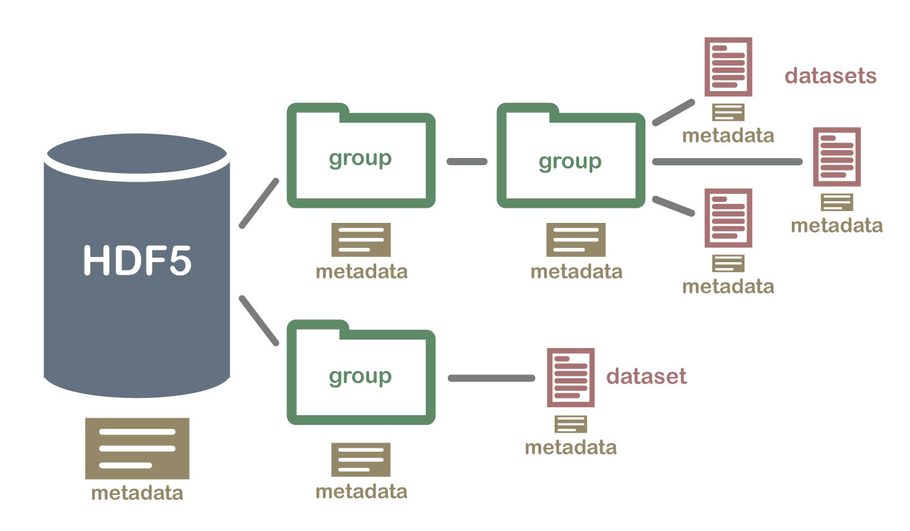
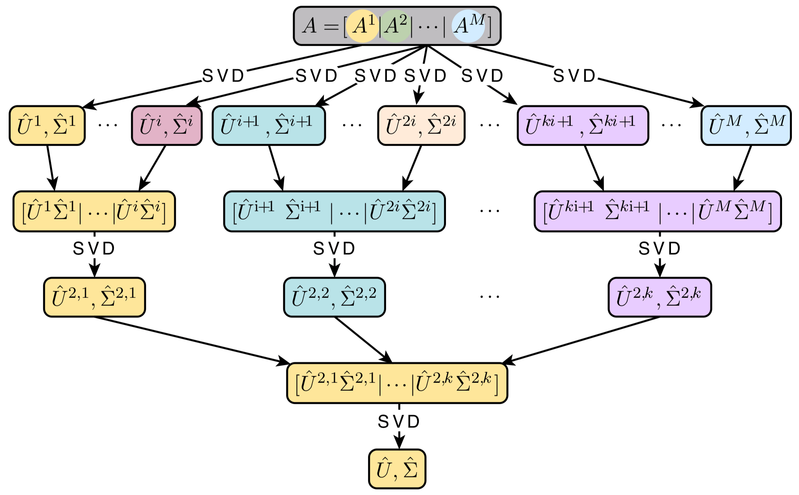

```{r setup, include = FALSE}
library(knitr)
library(BiocStyle)

knitr::opts_chunk$set(collapse = TRUE, comment = "", cache = FALSE, message = FALSE, width = 180, crop = NULL)
```

# Overview

This package implements several matrix operations using `Matrix` objects as well as HDF5 data files. Some basic algebra operations that can also be computed that are useful to implement  statistical analyses using standard methodologies such as principal component analyses (PCA) or least squares estimation. The package also contains specific statistical methods mainly used in `omic` data analysis such as lasso regression.


# Prerequisites

The package requires other packages from `CRAN` and `Bioconductor` to be installed. 

- `CRAN`: `Matrix`, `RcppEigen` and `RSpectra`.
- `Bioconductor`:  `HDF5array`

The user can execute this code to install the required packages:

```{r install_required, eval=FALSE}
# Install BiocManager (if not previously installed)
install.packages("BiocManager") 

# Install required packages
BiocManager::install(c("Matrix", "RcppEigen", "RSpectra", "HDF5Array"))
```


Our package needs to be installed from source code. In such cases, a collection of software (e.g. C, C++, Fortran, ...) are required, mainly for Windows users. These programs can be installed using [Rtools](https://cran.r-project.org/bin/windows/Rtools/).


# Install package

Once required packages and Rtools are installed, `BigDataStatMeth` package can be installed from our GitHub repository as follows:

```{r, install, eval=FALSE}
# Install devtools and load library (if not previously installed)
install.packages("devtools") 
library(devtools)

# Install BigDataStatMeth 
install_github("isglobal-brge/BigDataStatMeth")
```


# Getting started

First, let us start by loading the required packages to describe the main capabilities of the package

```{r, load, cache=FALSE}
library(BigDataStatMeth)
```

## Architecture overview

`BigDataStatMeth` uses a hybrid **R6+S3 architecture**. Internally, R6 classes manage the C++ state and the HDF5 resource lifecycle (file handles, dataset pointers). Externally, standard R S3 generics expose a familiar interface: `HDF5Matrix` objects behave like regular R matrices and respond to standard generics such as `dim()`, `[`, `%*%`, `crossprod()`, `svd()`, `qr()`, `chol()`, `scale()`, `cor()`, and others.

Users interact **exclusively through the S3 layer** — direct use of R6 methods (`x$method()`) is internal and should not appear in user code, examples, or vignettes.


# Previous knowledge

## HDF5 data files

Hierarchical Data Format (HDF) is a set of file formats  designed to store and organize large amounts of data. It is supported by The HDF Group, a non-profit corporation whose mission is to ensure continued development of HDF5 technologies and the continued accessibility of data stored in HDF.

HDF5 is a technology suite that makes possible the management of extremely large and complex data collections, can accommodate virtually every kind of data in a single file, sequences, images, SNP matrices, and every other type of data and metadata associated with an experiment.

There is no limit on the number or size of data objects in the collection, giving great flexibility for omic data. Is high-performance I/O with a rich set of integrated performance features that allow for access time and storage space optimizations

HDF5 file structure include only *two major types of object*:

- `Datasets`, which are multidimensional arrays of a homogeneous type. For example, datasets for omics data could be to genomics, transcriptomics, epigenomics, proteomics and/or metabolomics experiments

- `Groups`, which are container structures which can hold datasets and other groups

This results in a truly hierarchical, filesystem-like data format

```{r hdf5Img, out.width = '100%', fig.align = 'center', fig.cap = "HDF5 hierarchical structure", echo=FALSE}

```


## Basics in hdf5 files using R

**Create hdf5 file**

We have implemented the `hdf5_create_matrix()` function to create an HDF5 file with a group and a dataset in a single step. This function allows creating datasets from standard R matrices and returns an `HDF5Matrix` object ready for use.

```{r hdf5Create}

fn_robject   <- tempfile(fileext = ".hdf5")

set.seed(5234)
n <- 500
m <- 600
A <- matrix(rnorm(n*m,mean=0,sd=1), n,m)

# Create a dataset from R matrix object; returns an HDF5Matrix
A_hdf5 <- hdf5_create_matrix(fn_robject, "INPUT/A", data = A)
A_hdf5
```

Notice that a temporary HDF5 file will be created for this session at `r fn_robject`

```{r ls}
list.files(pattern = "*.hdf5")
```


**Add datasets in hdf5 file**

The function `hdf5_create_matrix()` also allows adding a dataset to an existing HDF5 file. We can create the dataset in any group; if the group does not exist in the file, it is created automatically.

```{r hdf5AddDataset}
set.seed(5234)
n <- 500
m <- 1000
A <- matrix(rnorm(n*m,mean=0,sd=1), n, m)

set.seed(5234)
n <- 1000
m <- 12000
B <- matrix(rnorm(n*m,mean=3,sd=0.5), n, m)

# Path to HDF5 file
example_fn  <- tempfile(fileext = ".hdf5")

# Create file with matrix A in group INPUT
A_hdf5 <- hdf5_create_matrix(example_fn, "INPUT/A", data = A)

# Add matrix B to the same file and group
B_hdf5 <- hdf5_create_matrix(example_fn, "INPUT/B", data = B)
```


**Open and get hdf5 content file**

We can list the contents of an HDF5 file using `list_datasets()`. This function accepts either an `HDF5Matrix` object or a file path.

```{r hdf5Show}
# List datasets in the file
list_datasets(example_fn, group = "/", recursive = TRUE)
```

To open an existing dataset from an HDF5 file and obtain an `HDF5Matrix` object, use `hdf5_matrix()`. This is the S3 equivalent of the old `H5Fopen()` — instead of a raw file handle it returns a ready-to-use `HDF5Matrix`:

```{r hdf5Open, cache=FALSE}
# Open an existing dataset from file — returns an HDF5Matrix
A_hdf5 <- hdf5_matrix(fn_robject, "INPUT/A")
A_hdf5
```

NOTE: We can also use [hdfview](https://www.hdfgroup.org/downloads/hdfview/)


**Access datasets data**

The `[` operator can be used to read subsets of data from an `HDF5Matrix` object without loading the entire dataset into memory.

```{r hdf5Dataset}
B_hdf5[1:3, 1:5]
```

And finally, we close all open HDF5 handles.

```{r hdf5DatasetClose}
hdf5_close_all()
```


# Convert text file to HDF5 

Usually we have files with a large amount of data to be loaded into R. For Big data problem, R can't deal with this data so we cannot efficiently work with then. In order to resolve this issue, you can work directly from data on disk with datasets stored in an HDF5 data file.

You can easily import your text files into HDF5 using the function `hdf5_import()`. You only have to define the input file with the `source` parameter and the HDF5 destination with `filename` and `dataset`. It should be considered that:

- This function **only allows to import numeric data except for rownames and colnames where character are allowed**. 

- Data can be delimited by different characters. By default, separator is auto-detected from file extension.

In this example we convert the "colesterol.csv" file and we will save the data to a file 'colesterol_file.hdf5' under the group 'COLESTEROL' in the dataset 'COLESTEROLDATA'. The function returns an `HDF5Matrix` object ready for use.

```{r convert_HDF5, cache=FALSE}
fn_colest    <- tempfile(fileext = ".hdf5")

import_hdf5 <- hdf5_import(
  source   = "colesterol.csv",
  filename = fn_colest,
  dataset  = "COLESTEROL/COLESTEROLDATA",
  sep      = ",",
  header   = TRUE,
  overwrite = TRUE
)
```

If we observe the new file `colesterol_file.hdf5` and its content

```{r read_data_col_HDF5}
# Show content
list_datasets(import_hdf5)

# Show first rows and columns
import_hdf5[1:5, 1:6]

# Show colnames
head(colnames(import_hdf5))
```

NOTE: We can overwrite an existing HDF5 dataset with new data by setting `overwrite = TRUE`.


# Operation with HDF5 files

Once our data are available as HDF5 files, we can operate directly on it without having data on memory (i.e we have access from disk). In `BigDataStatMeth` we have implemented most of the common matrix operations and algebra functions using standard R generics, so that `HDF5Matrix` objects behave like regular R matrices. Next section provides several examples


## HDF5 Matrix Multiplication

Matrix multiplication on `HDF5Matrix` objects uses the standard `%*%` operator. The computation is performed blockwise on disk, so neither matrix needs to fit in memory.

```{r blockmult_hdf5_exec}
# Reopen datasets (handles were closed above)
A_hdf5 <- hdf5_matrix(example_fn, "INPUT/A")
B_hdf5 <- hdf5_matrix(example_fn, "INPUT/B")

# Perform blockwise matrix multiplication
res <- A_hdf5 %*% B_hdf5

# Show the content of the HDF5 file
list_datasets(res)
```
We can then extract a portion of the result to validate correctness:

```{r blockmult_hdf5_res}
# Extract a subset of the result from HDF5
result_hdf5 <- res[1:3, 1:5]
result_hdf5

# Compute the same multiplication in R
result_r <- (A %*% B)[1:3, 1:5]
result_r

# Compare both results
all.equal(A %*% B, as.matrix(res))
```

This confirms that the result obtained with the C++ HDF5-based backend is numerically identical to the result obtained using R's in-memory multiplication.


## Crossproduct and Transposed Crossproduct in HDF5

The standard `crossprod()` and `tcrossprod()` generics are implemented for `HDF5Matrix` objects in the `BigDataStatMeth` package. These functions allow working with large matrices that may not fit in memory, by performing the computation in chunks.

Both functions can operate on a **single matrix** or on **two matrices**:

- If only matrix `A` is provided:
  - `crossprod(A)` computes `t(A) %*% A`
  - `tcrossprod(A)` computes `A %*% t(A)`
- If both matrices `A` and `B` are provided:
  - `crossprod(A, B)` computes `t(A) %*% B`
  - `tcrossprod(A, B)` computes `A %*% t(B)`


**Crossproduct of a single matrix**

```{r crossprod_sing}
# Create example matrices
set.seed(123)
A <- matrix(rnorm(1000 * 200), nrow = 1000, ncol = 200)
B <- matrix(rnorm(1000 * 150), nrow = 1000, ncol = 150)
C <- matrix(rnorm(800 * 200),  nrow = 800,  ncol = 200) 

# Save matrices to HDF5 file
hdf5_close_all()
unlink(example_fn)

A_hdf5 <- hdf5_create_matrix(example_fn, "INPUT/A", data = A)
B_hdf5 <- hdf5_create_matrix(example_fn, "INPUT/B", data = B)
C_hdf5 <- hdf5_create_matrix(example_fn, "INPUT/C", data = C)

# Compute t(A) %*% A
res_cross <- crossprod(A_hdf5)

# Show where the result is stored
list_datasets(res_cross)

# Compare with R's crossprod
res_hdf5 <- as.matrix(res_cross)
res_r <- crossprod(A)

all.equal(res_r, res_hdf5)
```

**Crossproduct of two matrices**
```{r crossprod_dbl}
# Compute t(A) %*% B
res_cross2 <- crossprod(A_hdf5, B_hdf5)

# Compare with R
res_hdf5 <- as.matrix(res_cross2)
res_r <- crossprod(A, B)

all.equal(res_r, res_hdf5)
```

**Transposed Crossproduct of a single matrix**

```{r tcrossprod_sing}
# Compute A %*% t(A)
res_tcross <- tcrossprod(A_hdf5)

list_datasets(res_tcross)

res_hdf5_t <- as.matrix(res_tcross)
res_r_t <- tcrossprod(A)

all.equal(res_r_t, res_hdf5_t)
```

**Transposed Crossproduct of two matrices**
```{r tcrossprod_dbl}
# Compute A %*% t(C)
res_tcross2 <- tcrossprod(A_hdf5, C_hdf5)

res_hdf5_t <- as.matrix(res_tcross2)
res_r_t <- tcrossprod(A, C)

all.equal(res_r_t, res_hdf5_t)
```


These examples confirm that both crossproduct and transposed crossproduct computations done with the HDF5-based C++ backend are equivalent to the results produced by R's `crossprod()` and `tcrossprod()` functions, while allowing better scalability and performance for large datasets.


**Crossproduct Combinations Supported**

The following table summarizes the types of crossproduct operations supported:

| Operation              | Single matrix    | Two matrices       |
|------------------------|------------------|--------------------|
| `crossprod(A, B)`      | `t(A) %*% A`     | `t(A) %*% B`       |
| `tcrossprod(A, B)`     | `A %*% t(A)`     | `A %*% t(B)`       |

These operations are executed efficiently using C++ backends and blockwise computation on HDF5 datasets, making them suitable for large-scale matrix operations.


## Blockwise Matrix Subtraction in HDF5

The `-` operator is implemented for `HDF5Matrix` objects and performs blockwise element-wise subtraction without requiring either matrix to be fully loaded into memory.


```{r substract_init}
# Create two matrices of the same dimensions
set.seed(42)
A_sub <- matrix(rnorm(1000 * 300), nrow = 1000, ncol = 300)
B_sub <- matrix(rnorm(1000 * 300), nrow = 1000, ncol = 300)

# Save them to HDF5
# fn_sub <- "subtraction_example.hdf5"
fn_sub <- tempfile(fileext = ".hdf5")

A_sub_hdf5 <- hdf5_create_matrix(fn_sub, "INPUT/A_sub", data = A_sub)
B_sub_hdf5 <- hdf5_create_matrix(fn_sub, "INPUT/B_sub", data = B_sub)

# Perform subtraction: A - B
res_sub <- A_sub_hdf5 - B_sub_hdf5

# Compare a subset with R
result_hdf5 <- as.matrix(res_sub)
result_r <- A_sub - B_sub

all.equal(result_r, result_hdf5)
```

The result stored in HDF5 is numerically identical to the in-memory computation of $A - B$ in R, validating the blockwise approach.


## Blockwise Matrix Addition in HDF5

The `+` operator is implemented for `HDF5Matrix` objects and performs blockwise element-wise addition on large matrices stored in HDF5 format.


```{r add}
# Create two compatible matrices
set.seed(99)
A_add <- matrix(rnorm(800 * 250), nrow = 800, ncol = 250)
B_add <- matrix(rnorm(800 * 250), nrow = 800, ncol = 250)

# Save them to HDF5
# fn_add <- "addition_example.hdf5"
fn_add <- tempfile(fileext = ".hdf5")

A_add_hdf5 <- hdf5_create_matrix(fn_add, "INPUT/A", data = A_add)
B_add_hdf5 <- hdf5_create_matrix(fn_add, "INPUT/B", data = B_add)

# Perform addition: A + B
res_add <- A_add_hdf5 + B_add_hdf5

# Compare result with R
result_hdf5 <- as.matrix(res_add)
result_r <- A_add + B_add

all.equal(result_r, result_hdf5)
```

Like subtraction, the addition operation yields identical results to standard R arithmetic but can scale to matrices stored on disk using the HDF5 format.


<!-- %%%%%%%%%%%%%%%%%%%%%%%%%%%%%%%%%%%%%%%%%%%%%%%%%%%%%%%%%%%%%%%%%%%%%%% -->

# Matrix Decompositions and Inverses

## Singular Value Decomposition (SVD)

The SVD of an $m \times n$ real or complex matrix $A$ is a factorization of the form:

$$U\Sigma { V }^{ T }$$

where :

- $U$ is a $m \times m$ real or complex unitary matrix
- $\Sigma$ is a $m \times n$ rectangular diagonal matrix with non-negative real numbers on the diagonal
- $V$ is a $n \times n$ real or complex unitary matrix.

Notice that:

- The diagonal entries $\sigma_i$ of $\Sigma$ are known as the singular values of $A$.
- The columns of $U$ are called the left-singular vectors of $A$.
- The columns of $V$ are called the right-singular vectors of $A$.


### Block Singular Values Decomposition

This method was developed by M. A. Iwen and B. W. Ong (2016). The authors introduced a distributed and incremental SVD algorithm that is useful for agglomerative data analysis on large networks. The algorithm calculates the singular values and left singular vectors of a matrix A, by first, partitioning it by columns. This creates a set of submatrices of A with the same number of rows, but only some of its columns. After that, the SVD of each of the submatrices is computed. The final step consists of combining the results obtained by merging them again and computing the SVD of the resulting matrix.

```{r BSVDImg, out.width = '100%', fig.align = 'center', fig.cap = "Flowchart for a two-level hierarchical Block SVD algorithm", echo=FALSE}

```

This method is implemented via the S3 generic `svd()` for `HDF5Matrix` objects. It works directly on HDF5 data format, loading in memory only the data needed for calculations and saving the results back to the HDF5 file. The function returns a list with `d` (numeric vector of singular values), `u` and `v` (HDF5Matrix objects for the singular vectors).

We have to indicate the file to work with and the dataset path:

```{r BlockSVDNorm}
# Create dataframe data with 'omicdata' matrix in delayed hdf5 file at OMICS group
set.seed(5234)
n <- 100
m <- 15000
omicdata <- matrix(rnorm(n*m, mean=0, sd=1), n, m)

omic_hdf5 <- hdf5_create_matrix(example_fn, "OMICS/data", data = omicdata, overwrite = TRUE)

# SVD directly on HDF5Matrix — d is returned as a numeric vector
svdh5 <- svd(omic_hdf5)

# Results: d is already a numeric vector, no need to read from file
svdh5$d[1:7]

svd_r <- svd(scale(omicdata))
svd_r$d[1:7]
```


Like in Simple Singular Value Decomposition we can normalize, center or scale data before proceed with SVD decomposition with `scale` and `center` parameters, by default these parameters are TRUE, data is normalized before SVD decomposition. To proceed with SVD without normalization :

```{r BlockSVDNotNorm}
# SVD without normalization
svdh5 <- svd(omic_hdf5, center = FALSE, scale = FALSE, overwrite = TRUE)
```

```{r BlockSVDNotNormResults}
# SVD (d) from file - data not normalized
svdh5$d[1:7]

# with R implementation from data in memory
svd(omicdata)$d[1:7]
```

In the SVD decomposition by blocks we can indicate the number of decomposition levels and number of local SVDs to concatenate at each level with parameters `q` and `k` respectively, by default `q = 1` one level with `k=2`.

```{r BlockSVDk4}
# Block decomposition with 1 level and 4 local SVDs at each level using 
# two threads (as maximum)
svdh5 <- svd(omic_hdf5, k = 4, q = 1, threads = 2, overwrite = TRUE)

# SVD (d) — data centered and scaled by default
svdh5$d[1:7]

# with R implementation from data in memory
svd(scale(omicdata))$d[1:7]
```

## Cholesky Decomposition

The Cholesky decomposition is a matrix factorization technique applicable to symmetric, positive-definite matrices. It decomposes a matrix $A$ into the product of a lower triangular matrix $L$ and its transpose, such that: 
$$
A = L \cdot L^\top
$$
This method is particularly useful for solving systems of linear equations, inverting matrices, and performing efficient numerical computations.

The `BigDataStatMeth` package provides the `chol()` generic for `HDF5Matrix` objects to compute the Cholesky decomposition of a symmetric, positive-definite matrix stored in HDF5 format. This function operates directly on disk-stored data, minimizing memory usage while maintaining computational efficiency.

Here's how to use `chol()`:


```{r cholDesc}
N <- 100
set.seed(5234)
Y <- matrix(rnorm(N*N), N, N)
Ycp <- crossprod(Y)

hdf5_close_all()
unlink(example_fn)

Ycp_hdf5 <- hdf5_create_matrix(example_fn, "chol/data", data = Ycp)

cholh5 <- chol(Ycp_hdf5)
choldesc_hdf5 <- as.matrix(cholh5)
choldesc_hdf5[1:3, 1:5]

choldesc_r <- chol(Ycp)
choldesc_r[1:3, 1:5]

all.equal(choldesc_hdf5, choldesc_r)
```

The computation can be further optimized by specifying the `block_size` parameter, which determines the approximate number of elements to include in each processing block. For example, setting `block_size = 50` instructs the function to process the matrix in chunks of approximately 50 elements, balancing speed and memory use.


```{r cholDesc_50}
cholh5 <- chol(Ycp_hdf5,
               block_size = 50,
               overwrite  = TRUE)

choldesc_hdf5 <- as.matrix(cholh5)
choldesc_hdf5[1:3, 1:5]

choldesc_r <- chol(Ycp)
choldesc_r[1:3, 1:5]

all.equal(choldesc_hdf5, choldesc_r)
```

## QR Decomposition

The QR decomposition is a matrix factorization technique in which a matrix $A$ is decomposed into the product of an orthogonal matrix $Q$ and an upper triangular matrix $R$, such that:

$$
A = Q \cdot R
$$

This decomposition is widely used in numerical linear algebra for solving least squares problems, eigenvalue computations, and matrix inversion. In the context of large-scale data, computing the QR decomposition efficiently and in a memory-safe manner becomes essential.

The `BigDataStatMeth` package implements the `qr()` generic for `HDF5Matrix` objects. The result is a named list with `Q` and `R` as `HDF5Matrix` objects. The computation is done in blocks, allowing it to scale to datasets that do not fit in memory.

In this example, we apply the QR decomposition to the matrix `data` inside the group `chol` that was stored in HDF5 format in the previous section.


```{r QRdec}
Ycp_hdf5 <- hdf5_matrix(example_fn, "chol/data")

QRh5 <- qr(Ycp_hdf5, thin = TRUE)

QR_Q_hdf5 <- as.matrix(QRh5$Q)
QR_R_hdf5 <- as.matrix(QRh5$R)

# Q matrix
QR_Q_hdf5[1:3, 1:5]

# R matrix
QR_R_hdf5[1:3, 1:5]

# Q matrix in R
QR_Q_r <- qr.Q(qr(Ycp))
QR_Q_r[1:3, 1:5]

all.equal(QR_Q_hdf5, QR_Q_r)
```

In this example, we show how to control the block size used during the computation by setting the `block_size` parameter. Adjusting this value can help improve performance depending on the available memory and system architecture.

```{r QRdec_blocksize}
QRh5 <- qr(Ycp_hdf5,
            block_size = 256,
            overwrite  = TRUE)

QR_Q_hdf5 <- as.matrix(QRh5$Q)
QR_R_hdf5 <- as.matrix(QRh5$R)

# Q matrix
QR_Q_hdf5[1:3, 1:5]

# R matrix
QR_R_hdf5[1:3, 1:5]

# Q matrix in R
QR_Q_r <- qr.Q(qr(Ycp))
QR_Q_r[1:3, 1:5]

all.equal(QR_Q_hdf5, QR_Q_r)
```


## Cholesky-based Matrix Inversion


The Cholesky decomposition is a matrix factorization technique applicable to symmetric, positive-definite matrices. It expresses a matrix $A$ as the product of a lower triangular matrix $L$ and its transpose:

$$
A = L \cdot L^\top
$$

This decomposition is particularly useful for solving linear systems and computing matrix inverses in a numerically stable and efficient way.

The `BigDataStatMeth` package implements the `solve()` generic for `HDF5Matrix` objects to compute the inverse of a symmetric, positive-definite matrix via Cholesky decomposition.

```{r CholInv}
invCholh5 <- solve(Ycp_hdf5)

invChol_hdf5 <- as.matrix(invCholh5)
invChol_hdf5[1:5, 1:5]
```

The argument `full_matrix` controls whether the full symmetric inverse is stored (`TRUE`, default) or only the upper triangular part (`FALSE`), which reduces disk usage when the matrix is symmetric.


```{r CholInv_full}
invCholh5 <- solve(Ycp_hdf5, full_matrix = TRUE, overwrite = TRUE)

invChol_hdf5 <- as.matrix(invCholh5)
invChol_hdf5[1:5, 1:5]

# Inverse matrix in R
invChol_r <- solve(Ycp)
invChol_r[1:5, 1:5]

all.equal(invChol_hdf5, invChol_r)
```


```{r, final_cleanup, echo=FALSE, include=FALSE}
hdf5_close_all()
for (f in c(fn_robject, example_fn, fn_colest, fn_sub, fn_add)) {
  if (file.exists(f)) unlink(f)
}
```

# Session information
```{r sesinfo }
sessionInfo()
```
