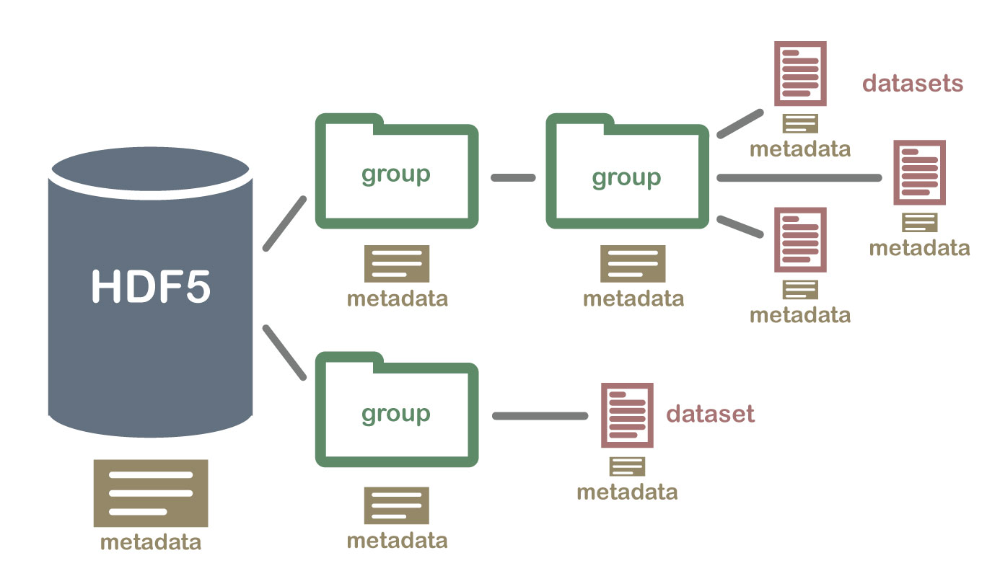

```{r setup, include = FALSE}
library(knitr)
library(BiocStyle)

knitr::opts_chunk$set(collapse = TRUE, comment = "", cache = FALSE, message = FALSE, width = 180, crop = NULL)
```

```{r, cleanup, echo=FALSE, include=FALSE}
if( isTRUE(file.exists('delayed.hdf5'))) {
    file.remove('delayed.hdf5')
}
if( isTRUE(file.exists('robject.hdf5'))){
    file.remove('robject.hdf5')
}
# if( isTRUE(file.exists('rna_file.hdf5'))){
#     file.remove('rna_file.hdf5')
# }
```

# Overview

This package implements several matrix operations using `Matrix` objects as well as HDF5 data files. Some basic algebra operations that can also be computed that are useful to implement  statistical analyses using standard methodologies such as principal component analyses (PCA) or least squares estimation. The package also contains specific statistical methods mainly used in `omic` data analysis such as lasso regression.


# Prerequisites

The package requires other packages from `CRAN` and `Bioconductor` to be installed. 

- `CRAN`: `Matrix`, `RcppEigen` and `RSpectra`.
- `Bioconductor`:  `HDF5array`, `rhdf5` 

The user can execute this code to install the required packages:

```{r install_required, eval=FALSE}
# Install BiocManager (if not previously installed)
install.packages("BiocManager") 

# Install required packages
BiocManager::install(c("Matrix", "RcppEigen", "RSpectra",
                       "HDF5Array", "rhdf5"))
```


Our package needs to be installed from source code. In such cases, a collection of software (e.g. C, C++, Fortran, ...) are required, mainly for Windows users. These programs can be installed using [Rtools](https://cran.r-project.org/bin/windows/Rtools/).


# Install package

Once required packages and Rtools are installed, `BigDataStatMeth` package can be installed from our GitHub repository as follows:

```{r, install, eval=FALSE}
# Install devtools and load library (if not previously installed)
install.packages("devtools") 
library(devtools)

# Install BigDataStatMeth 
install_github("isglobal-brge/BigDataStatMeth")
```


# Getting started

First, let us start by loading the required packages to describe the main capabilities of the package

```{r, load, cache=FALSE}
library(rhdf5)
library(BigDataStatMeth)
```


# Previous knowledge

## HDF5 data files

Hierarchical Data Format (HDF) is a set of file formats  designed to store and organize large amounts of data. It is supported by The HDF Group, a non-profit corporation whose mission is to ensure continued development of HDF5 technologies and the continued accessibility of data stored in HDF.

HDF5 is a technology suite that makes possible the management of extremely large and complex data collections, can accomodate virtually every kind of data in a single file, sequences, images, SNP matrices, and every other type of data and metadata associated with an experiment.

There is no limit on the number or size of data objects in the collection, giving great flexibility for omic data. Is high-performance I/O with a rich set of integrated performance features that allow for access time and storage space optimizations

HDF5 file structure include only *two major types of object*:

- `Datasets`, which are multidimensional arrays of a homogeneous type. For example, datasets for omics data could be to genomics, transcriptomics, epigenomics, proteomics and/or metabolomics experiments

- `Groups`, which are container structures which can hold datasets and other groups

This results in a truly hierarchical, filesystem-like data format

```{r hdf5Img, out.width = '100%', fig.align = 'center', fig.cap = "HDF5 hierarchical structure", echo=FALSE}

```


## Basics in hdf5 files using R

**Create hdf5 file**

We have implemented the `bdCreate_hdf5_matrix_file ()` function to create an hdf5 file with a group and a dataset in a single step. This function allows to create datasets from a standard R matrices from `Matrix` objects.

```{r hdf5Create}
library(rhdf5)

set.seed(5234)
n <- 500
m <- 600
A <- matrix(rnorm(n*m,mean=0,sd=1), n,m)

# We also can create a dataset from R matrix object
bdCreate_hdf5_matrix(filename = "robject.hdf5", 
                     object = A,
                     group = "INPUT", 
                     dataset = "A",
                     overwriteFile = TRUE)
```

We see 0 in the console, indicating that no errors where found when creating the hdf5 file. Notice that a file called "robject.hdf5" will be created in the working directory

```{r ls}
list.files(pattern = "*.hdf5")
```


**Add datasets in hdf5 file**

The function `bdCreate_hdf5_matrix()` also allows to add a dataset in a existing hdf5 file. We can create the dataset in any group, if group doesn't exists in file, the group is created before append the dataset. 

```{r hdf5AddDataset}
set.seed(5234)
n <- 500
m <- 1000
A <- matrix(rnorm(n*m,mean=0,sd=1), n, m)

set.seed(5234)
n <- 1000
m <- 12000
B <- matrix(rnorm(n*m,mean=3,sd=0.5), n, m)

# Path to HDF5 file
fn_example <- "delayed.hdf5"

# We create another data file (delayed.hdf5) with a matrix A.
# The group is called INPUT, overwriteFile is set to true to 
# overwrite a file if exists
bdCreate_hdf5_matrix(filename = fn_example, 
                     object = A, 
                     group = "INPUT", 
                     dataset = "A", 
                     overwriteFile = TRUE)

# And them, we add another matrix B to the same group
bdCreate_hdf5_matrix(object = B, 
                filename = fn_example, 
                group = "INPUT", 
                dataset = "B")
```


**Open and get hdf5 content file**

We can open an existing file show contents and access data using functions from `rhdf5` package. `rhdf5` is an R interface for HDF5. The file must always be opened before working with it.

With `htls()` function we get the the list of an hdf5 content without the need of open the file.

```{r hdf5Show}
# Examine hierarchy before open file
h5ls(fn_example)
```

Once opened, it can be seen just typing its name. In that case, we only get the current level in the hierarchical tree

```{r hdf5Open, cache=FALSE}
# Open file
h5fdelay <- H5Fopen(fn_example)
# Show hdf5 hierarchy (groups)
h5fdelay
```

NOTE: We can also use [hdfview](https://www.hdfgroup.org/downloads/hdfview/)


**Access datasets data**

The \$ operator can be used to access the next group level, this operator reads the object from disk. We can assign the dataset contents to an R object in order to work with it.

```{r hdf5Dataset}
bdata <- h5fdelay$INPUT$B
bdata[1:3,1:5]
```

And finally, we close the opened files.

```{r hdf5DatasetClose}
h5closeAll()
```


# Operation with HDF5 files

Once our data are available as hdf5 files, we can operate directly on it without having data on memory (i.e we have access from disk. In `BigDataStatMeth` we have implemented most of the common matrix operations and algebra functions to help users how are not familiar with this type of implementation. Next section provides several examples


## HDF5 Matrix Multiplication

If we have the matrices stored in hdf5 data file, we can use the function `bdblockmult_hdf5()`. This function allows to perform a matrix multiplication from two matrices stored in a file.


The `bdblockmult_hdf5()` function in the `BigDataStatMeth` package performs efficient matrix multiplication by blocks, directly on datasets stored in an HDF5 file. This allows scalable computation even when the matrices do not fit into memory.

If the `outgroup` is not specified, the result is written to the `"OUTPUT"` group by default. Likewise, if the `outdataset` is not provided, the output dataset name is constructed as `"A_x_B"`, where `A` and `B` are the names of the input datasets.

```{r blockmult_hdf5_exec}

# Perform blockwise matrix multiplication
res <- bdblockmult_hdf5(filename = fn_example, group = "INPUT",
                        A = "A", B = "B", outgroup = "HDF5_RES")

# Show the content of the HDF5 file
h5ls(res$fn)
```
We can then extract a portion of the result to validate correctness:

```{r blockmult_hdf5_res}
# Extract the result from HDF5
result_hdf5 <- h5read(res$fn, res$ds)[1:3, 1:5]
result_hdf5

# Compute the same multiplication in R
result_r <- (A %*% B)[1:3, 1:5]
result_r

# Compare both results
all.equal((A %*% B), h5read(res$fn, res$ds))
```

This confirms that the result obtained with the C++ HDF5-based backend is numerically identical to the result obtained using R’s in-memory multiplication.


## Crossproduct and Transposed Crossproduct in HDF5

The functions `bdCrossprod_hdf5()` and `bdtCrossprod_hdf5()` from the `BigDataStatMeth` package implement efficient versions of the crossproduct operations using blockwise computation on HDF5 datasets. These functions allow working with large matrices that may not fit in memory, by performing the computation in chunks.

Both functions can operate on a **single matrix** or on **two matrices**:

- If only matrix `A` is provided:
  - `bdCrossprod_hdf5()` computes `t(A) %*% A`
  - `bdtCrossprod_hdf5()` computes `A %*% t(A)`
- If both matrices `A` and `B` are provided:
  - `bdCrossprod_hdf5()` computes `t(A) %*% B`
  - `bdtCrossprod_hdf5()` computes `A %*% t(B)`

By default, the output is stored in the `"OUTPUT"` group. If `outdataset` is not specified, the default dataset names are:
- `"Crossprod_A_x_B"` for `bdCrossprod_hdf5()`
- `"tCrossprod_A_x_B"` for `bdtCrossprod_hdf5()`
where A and B refer to the names of the input datasets provided via the A and B arguments, respectively. If only matrix A is specified (i.e., B is missing), then the name becomes "Crossprod_A" or "tCrossprod_A". This naming convention ensures traceability of the operation and the involved datasets within the HDF5 file structure.


**Crossproduct of a single matrix**

```{r crossprod_sing}

# Create example matrices
set.seed(123)
A <- matrix(rnorm(1000 * 200), nrow = 1000, ncol = 200)
B <- matrix(rnorm(1000 * 150), nrow = 1000, ncol = 150)
C <- matrix(rnorm(800 * 200),  nrow = 800,  ncol = 200) 

# Save matrices to HDF5 file using BigDataStatMeth
fn_example <- "delayed.hdf5"

bdCreate_hdf5_matrix(filename = fn_example, 
                     object = A,
                     group = "INPUT", 
                     dataset =  "A", 
                     overwriteFile = TRUE)

bdCreate_hdf5_matrix(filename = fn_example,
                     object = B,
                     group = "INPUT", 
                     dataset =  "B", 
                     overwriteFile = FALSE)

bdCreate_hdf5_matrix(filename = fn_example,
                     object = C,
                     group = "INPUT", 
                     dataset = "C", 
                     overwriteFile = FALSE)

# Compute t(A) %*% A
res_cross <- bdCrossprod_hdf5(filename = fn_example, 
                              group = "INPUT", 
                              A = "A")

# Show where the result is stored
h5ls(res_cross$fn)

# Compare with R's crossprod
res_hdf5 <- h5read(res_cross$fn, res_cross$ds)
res_r <- crossprod(A)

all.equal(res_r, res_hdf5)
```
- For `bdtCrossprod_hdf5()`, it is `"tcrossprod_A"`.

**Crossproduct of two matrices**
```{r crossprod_dbl}
# Compute t(A) %*% B
res_cross2 <- bdCrossprod_hdf5(filename = fn_example, 
                               group = "INPUT", 
                               A = "A", 
                               B = "B")

# Compare with R
res_hdf5 <- h5read(res_cross2$fn, res_cross2$ds)
res_r <- crossprod(A, B)

all.equal(res_r, res_hdf5)
```

**Transposed Crossproduct of a single matrix**

```{r tcrossprod_sing}
# Compute A %*% t(A)
res_tcross <- bdtCrossprod_hdf5(filename = fn_example, 
                                group = "INPUT", 
                                A = "A")

h5ls(res_tcross$fn)

res_hdf5_t <- h5read(res_tcross$fn, res_tcross$ds)
res_r_t <- tcrossprod(A)

all.equal(res_r_t, res_hdf5_t)
```

**Transposed Crossproduct of two matrices**
```{r tcrossprod_dbl}
# Compute A %*% t(B)
res_tcross2 <- bdtCrossprod_hdf5(filename = fn_example, 
                                 group = "INPUT", 
                                 A = "A", 
                                 B = "C")

res_hdf5_t <- h5read(res_tcross2$fn, res_tcross2$ds)
res_r_t <- tcrossprod(A, C)

all.equal(res_r_t, res_hdf5_t)
```


These examples confirm that both crossproduct and transposed crossproduct computations done with the HDF5-based C++ backend are equivalent to the results produced by R's `crossprod()` and `tcrossprod()` functions, while allowing better scalability and performance for large datasets.


**Crossproduct Combinations Supported**

The following table summarizes the types of crossproduct operations supported by the functions `bdCrossprod_hdf5()` and `bdtCrossprod_hdf5()` in the *BigDataStatMeth* package.

| Function                | Matrix A | Matrix B (optional) | Operation         |
|------------------------|----------|---------------------|-------------------|
| `bdCrossprod_hdf5()`   | A        | —                   | `t(A) %*% A`      |
| `bdCrossprod_hdf5()`   | A        | B                   | `t(A) %*% B`      |
| `bdtCrossprod_hdf5()`  | A        | —                   | `A %*% t(A)`      |
| `bdtCrossprod_hdf5()`  | A        | B                   | `A %*% t(B)`      |

These operations are executed efficiently using C++ backends and blockwise computation on HDF5 datasets, making them suitable for large-scale matrix operations.


### Blockwise Matrix Subtraction in HDF5

The `bdblockSubstract_hdf5()` function performs blockwise element-wise subtraction of two matrices stored in an HDF5 file. It computes $A - B$, writing the result back into the file, without requiring either matrix to be fully loaded into memory.


```{r substract_init}

# Create two matrices of the same dimensions
set.seed(42)
A_sub <- matrix(rnorm(1000 * 300), nrow = 1000, ncol = 300)
B_sub <- matrix(rnorm(1000 * 300), nrow = 1000, ncol = 300)

# Save them to HDF5
fn_sub <- "subtraction_example.hdf5"

bdCreate_hdf5_matrix(filename = fn_sub, object = A_sub,
                     group = "INPUT", dataset = "A_sub",
                     overwriteFile = TRUE)

bdCreate_hdf5_matrix(filename = fn_sub, object = B_sub,
                     group = "INPUT", dataset = "B_sub",
                     overwriteFile = FALSE)

# Perform subtraction: A - B
res_sub <- bdblockSubstract_hdf5(filename = fn_sub,
                                  group = "INPUT",
                                  A = "A_sub", B = "B_sub")

# Compare a subset with R
result_hdf5 <- h5read(res_sub$fn, res_sub$ds)
result_r <- A_sub - B_sub

all.equal(result_r, result_hdf5)
```

The result stored in HDF5 is numerically identical to the in-memory computation of $A - B$ in R, validating the blockwise approach.


### Blockwise Matrix Addition in HDF5

The `bdblockSum_hdf5()` function performs blockwise element-wise addition of two matrices stored in HDF5 format. This is useful for efficiently computing $A + B$ on large matrices.


```{r add}
# Create two compatible matrices
set.seed(99)
A_add <- matrix(rnorm(800 * 250), nrow = 800, ncol = 250)
B_add <- matrix(rnorm(800 * 250), nrow = 800, ncol = 250)

# Save them to HDF5
fn_add <- "addition_example.hdf5"

bdCreate_hdf5_matrix(filename = fn_add, object = A_add,
                     group = "INPUT", dataset = "A",
                     overwriteFile = TRUE)

bdCreate_hdf5_matrix(filename = fn_add, object = B_add,
                     group = "INPUT", dataset = "B",
                     overwriteFile = FALSE)

# Perform addition: A + B
res_add <- bdblockSum_hdf5(filename = fn_add,
                            group = "INPUT",
                            A = "A", B = "B")

# Compare result with R
result_hdf5 <- h5read(res_add$fn, res_add$ds)
result_r <- A_add + B_add

all.equal(result_r, result_hdf5)
```

Like subtraction, the addition operation yields identical results to standard R arithmetic but can scale to matrices stored on disk using the HDF5 format.


## Singular Value Decomposition (SVD)

The SVD of an $m \times n$ real or complex matrix $A$ is a factorization of the form:

$$U\Sigma { V }^{ T }$$

where :

- $U$ is a $m \times m$ real or complex unitary matrix
- $\Sigma$ is a $m \times n$ rectangular diagonal matrix with non-negative real numbers on the diagonal
- $V$ is a $n \times n$ real or complex unitary matrix.

Notice that:

- The diagonal entries $\sigma_i$ of $\Sigma$ are known as the singular values of $A$.
- The columns of $U$ are called the left-singular vectors of $A$.
- The columns of $V$ are called the right-singular vectors of $A$.


### Block Singular Values Decomposition

This method was developed by M. A. Iwen and B. W. Ong (2016). The authors introduced a distributed and incremental SVD algorithm that is useful for agglomerative data analysis on large networks. The algorithm calculates the singular values and left singular vectors of a matrix A, by first, partitioning it by columns. This creates a set of submatrices of A with the same number of rows, but only some of its columns. After that, the SVD of each of the submatrices is computed. The final step consists of combining the results obtained by merging them again and computing the SVD of the resulting matrix.

```{r BSVDImg, out.width = '100%', fig.align = 'center', fig.cap = "Flowchart for a two-level hierarchical Block SVD algorithm", echo=FALSE}

```

This method is implemented in `bdSVD_hdf5` function, this function works directly on hdf5 data format, loading in memory only the data to perform calculations and saving the results again in the hdf5 file for later use.

We have to indicate the file to work with, the dataset name and the group where the dataset is located :

```{r BlockSVDNorm}
# Create dataframe data with 'odata' matrix in delayed hdf5 file at OMIC group
set.seed(5234)
n <- 100
m <- 15000
odata <- matrix(rnorm(n*m, mean=0, sd=1), n,m)

bdAdd_hdf5_matrix(odata, "delayed.hdf5", "OMICS", "data")

# Direct from hdf5 data file
svdh5 <- bdSVD_hdf5("delayed.hdf5", "OMICS", "data")

# with R implementation from data in memory
test <- H5Fopen("delayed.hdf5")
# get results svd (d)
svd_hdf5_d <- test$SVD$data$d[1:7]
# get data
omdata <- test$OMICS$data
h5closeAll()

# Results in hdf5 file for d
svd_hdf5_d[1:7]

svd <- svd(scale(omdata))
svd$d[1:7]
```


Like in Simple Singular Value Decomposition we can normalize, center or scale data before proceed with SVD decomposition with `bscale` and `bcenter` parameters, by default this parameter are TRUE, data is normalized before SVD decomposition. To proceed with SVD without normalization :

```{r BlockSVDNotNorm}
# Direct from hdf5 data file (using only one thread, serial execution)
svdh5 <- bdSVD_hdf5( "delayed.hdf5", "OMICS", "data", 
                     bcenter = FALSE, bscale = FALSE,
                     k = 2, q = 1, threads = 1)
```

```{r BlockSVDNotNormResults}
# get results svd (d)
test <- H5Fopen("delayed.hdf5")
svd_hdf5_d <- test$SVD$data$d[1:7] 
h5closeAll()

# SVD (d) from file - data not normalized
svd_hdf5_d

# with R implementation from data in memory
svd <- svd(omdata)
svd$d[1:7]
```

In the SVD decomposition by blocks we can indicate the number of decomposition levels and number of local SVDs to concatenate at each level with parameters `q` and `k` respectively, by default `q = 1` one level with `k=2`.

```{r BlockSVDk4}
# Block decomposition with 1 level and 4 local SVDs at each level
svdh5 <- bdSVD_hdf5(file = "delayed.hdf5", group = "OMICS", dataset = "data",
                    threads = 2)

# get results svd (d)
fprova <- H5Fopen("delayed.hdf5")
  svd_hdf5_d <- fprova$SVD$data$d[1:7]
h5closeAll()

# SVD (d) from file - data not normalized
svd_hdf5_d

# with R implementation from data in memory
svd <- svd(scale(omdata))
svd$d[1:7]
```


# Session information
```{r sesinfo }
sessionInfo()
```